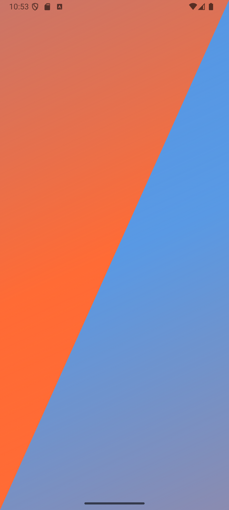
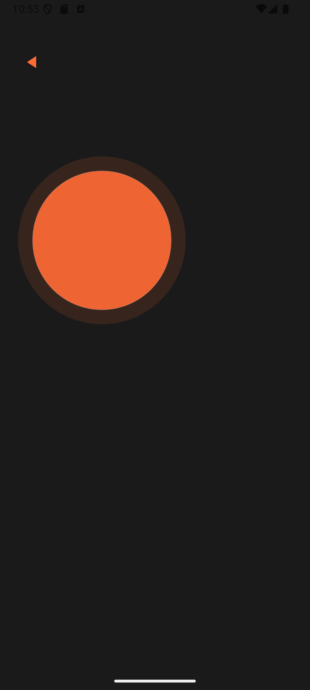

**<h1>Entheos Now</h1>**

A mobile performance state optimization app that helps users access flow states through intuitive gestural interactions and personalized music integration.

## 🚀 Try the Demo

**[Download Android APK](https://expo.dev/accounts/nwm516/projects/EntheosNow/builds/c1a0df3d-5364-43fb-9459-c8f8ea707166)** 
*Android 5.0+. Enable "Install from Unknown Sources" when prompted.*

## Screenshots
<table>
  <tr>
    <td></td>
    <td></td>
    <td></td>
  </tr>
  <tr>
    <td align="center">Energy State Selection</td>
    <td align="center">Intensity Calibration</td>
    <td align="center">Visual Reinforcement</td>
  </tr>
</table>

**<h2>The Problem</h2>**
Accessing optimal mental states for performance, whether it's for athletics, creative work, or presentations, typically requires extensive practice or external guidance. Most existing solutions are either too rigid (guided meditations) or too passive (background music apps), failing to engage users in the active process of state selection and intensity calibration.

**<h2>The Solution</h2>**
Entheos Now uses subtle, gesture-based interactions to help users consciously select and calibrate their desired mental state. The app combines psychology principles with intuitive UX design to create an "undercurrent" experience; guidance that feels natural rather than prescriptive.

**<h2>Core User Flow</h2>**

1) Energy State Selection - Diagonal split interface for choosing warm (activation) or cool (calm) energy states
2) Intensity Calibration - Spiral gesture control for fine-tuning state intensity (0-100%)
3) Visual Reinforcement - Responsive visualizer that reflects chosen state and intensity
4) Music Integration (in development) - Curated Spotify playlists matched to selected state

**<h2>Technical Implementation</h2>**
Stack:

- React Native + Expo (cross-platform mobile)
- TypeScript (type safety and developer experience)
- Animated API with native drivers (60fps animations)
- PanResponder (complex gesture handling)

**<h2>Key Technical Challenges Solved</h2>**

- Diagonal touch detection: Coordinate geometry for precise triangle area detection
- Spiral gesture recognition: Cumulative rotation tracking with bidirectional intensity control
- Animation performance: Native driver usage for smooth 60fps animations across multiple layers
- State management: Clean component communication pattern for navigation and data flow

**<h2>Architecture Highlights</h2>**
App.tsx (navigation controller) 
├── Diagonal Selection Screen 
│   └── Touch detection with geometric calculations 
├── Intensity Slider Component   
│   └── Spiral gesture with long-press confirmation 
└── Music Visualizer Component 
  └── Energy-responsive animations with intensity scaling 

**<h3>Design Philosophy</h3>**: "Subtlety at every level" - minimal text, intuitive interactions, visual feedback that guides without overwhelming.

**<h2>Current Development Status</h2>**
Completed:

✅ Diagonal energy state selection with animated triangles 
✅ Spiral gesture intensity control (clockwise to build, counter-clockwise to unwind) 
✅ Long-press confirmation pattern (800ms hold to proceed) 
✅ Responsive music visualizer with flowing elements 
✅ Back navigation between all screens 
✅ Energy-responsive color systems and animation speeds 

**<h2>In Progress</h2>**

🔄 Spotify API integration for curated playlist playback 
🔄 Music-reactive visualizations 

**<h2>Planned</h2>**

📋 User preference persistence 
📋 Additional gesture interactions (reset, refinement) 
📋 Advanced visual patterns 

**<h2>Running Locally</h2>**
_# Install dependencies_
npm install

_# Start Expo development server_
npx expo start

_# Scan QR code with Expo Go app (iOS/Android)_
_# Or press 'a' for Android emulator, 'i' for iOS simulator_

**<h2>Design Principles</h2>**
This project explores:

- Gestural interaction design - How can touch patterns convey meaning beyond tapping?
- Subtle guidance - How do you help users without explicit instructions?
- Performance psychology - How can technology facilitate mental state access?
- Animation as communication - Visual feedback that feels natural, not decorative

<h2>Why This Project?</h2>
As someone transitioning into software development with a background in theater, acting, and athletic performance, I'm interested in how technology can facilitate optimal mental states. This app represents my attempt to bridge performance psychology principles with mobile UX design, creating an experience that respects the user's intuition while providing effective guidance.
The technical challenge of building complex gesture interactions, performant animations, and state management across multiple screens in React Native has significantly developed my mobile development capabilities while allowing me to explore concepts I care deeply about.

<h3>Tech Stack:</h3>React Native, TypeScript, Expo, Animated API, PanResponder, Spotify Web API (integration in progress)
<h3>Development Timeline:</h3>July 2025 - Present
